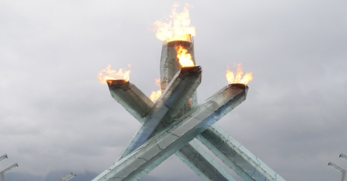
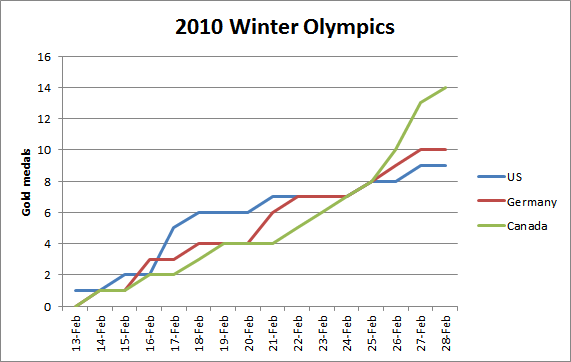

+++
date = '2010-03-16T23:09:45-05:00'
title = 'Olympic Gold Rush'
slug = 'olympic-gold-rush'
description = "I got to experience exciting, Olympic curling action. Plus, the Canadians really came from nowhere to blow away every other country in gold medals earned."
tags = [
    "sports",
]
+++

One of the benefits on living in the Seattle area is our proximity to Vancouver, BC.  While I don't get to visit the city as often as I'd like, we were fortunate enough to make a trip during the 2010 Winter Olympics.  We even got to attend the men's bronze medal curling match.  I have some photos from the trip [posted on Flickr](http://www.flickr.com/photos/erunama/sets/72157623528665020/).

That aside, I did have a thought about the total Olympic medal counts that is moderately interesting.

The Big Push
------------
There was a lot of controversy surrounding Canada's ["Own the Podium"](http://en.wikipedia.org/wiki/Own_the_Podium) program, aimed to make Canada the top medal winner at their games.  It was widely considered a failure after the first week of competition, with the country's athletes picking up a mere nine medals.

The final week, however, they gained 17 medals.  I started thinking about this huge breakthrough on the last Saturday, after the bronze medal curling match.  We were sitting eating lunch at [Steamworks Brewing Company](http://www.steamworks.com/) in downtown Vancouver.  In that short period of time, we got to watch the locals celebrating as Canadian athletes won two more gold medals (in parallel giant slalom and team pursuit).

I put together a little chart showing Canada's gold medal progress over the course of the 2010 games as compared to the two other top medal earners.  Not sure how insightful it is, but I found it interesting to map out the huge push made during the last few days.

