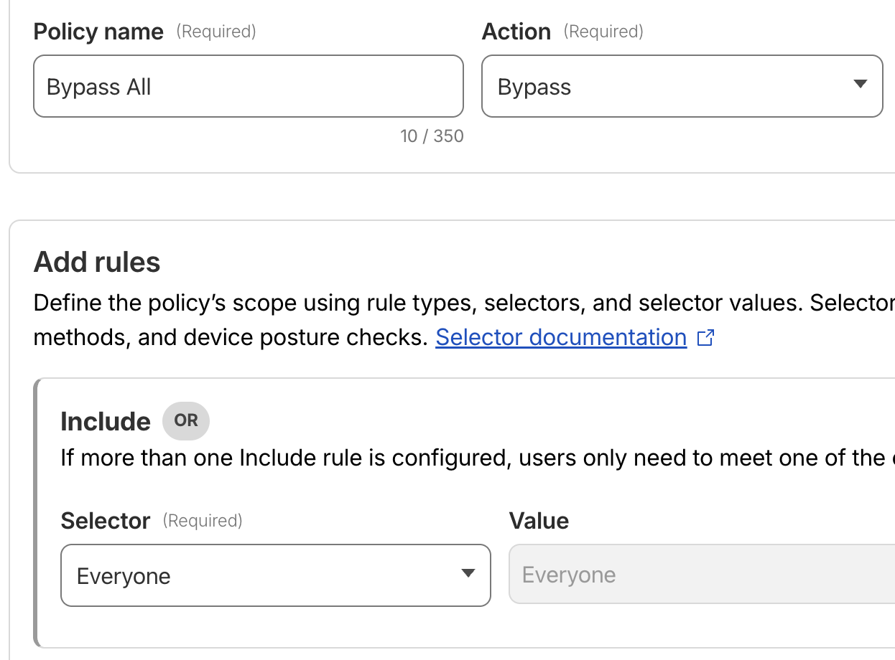

+++
date = '2026-01-30T00:20:00-05:00'
title = 'Customizing error code for Cloudflare mTLS cert check'
slug = 'customizing-error-code-cloudflare-mtls'
description = "Using Workers to work around a limitation in the Cloudflare free plan."
tags = [
    "cloudflare",
    "coding",
]
+++

Summary
-------

The [Bitwarden](https://bitwarden.com/) mobile app wipes its local cache when
receiving an HTTP 403 error. By default, a WAF rule in a Cloudflare free account
can only return a 403. This guide shows how to use Cloudflare Workers to validate
mTLS certificates and return an HTTP 404 instead.

Background
----------

For accessing internal services remotely, I have been a big fan of
[Cloudflare Tunnels](https://developers.cloudflare.com/cloudflare-one/networks/connectors/cloudflare-tunnel/).
This system provides an easy mechanism to provide
access without opening up firewall ports, and the ability to take
advantage of Cloudflare security controls like their
[Web Application Firewall (WAF)](https://developers.cloudflare.com/waf/)
and [Zero Trust access control](https://developers.cloudflare.com/cloudflare-one/access-controls/).

Previous authorization model
----------------------------

Up until recently, I have secured my internal applications with a
simple OAuth identity validation through Zero Trust. Depending on the identity
provider used, this can provide a significant amount of protection, but it
can cause issues with non-web based applications like mobile apps.

One simple alternative I've used is [Service Tokens](https://developers.cloudflare.com/cloudflare-one/access-controls/service-credentials/service-tokens/), which can be provided
via custom HTTP headers -- if the app I'm trying to use supports that type of
customization. However, this is quite rare, so I started looking for a more
universal approach.

mTLS authorization
------------------

Historically, during client/server communication, the focus has been on
ensuring the server endpoint is trustworthy, and where SSL/TLS is a standard
requirement. There are many use cases where the server may need to assess the
trustworthiness of the device communicating with it. For a very sensitive system like
a password manager, validating the device in addition to the user credentials provides
an extra layer of security.

Mutual TLS (mTLS) is a process that provides the missing validation, by having the
client provide its certificate to the server (after the client has validated the
server's certificate).

Cloudflare mTLS support on free plans
-------------------------------------

I am currently using Cloudflare's free plan, as the pricing for their Pro and
Business plans is quite lofty for a single household use case.

With the free plan, you can create certificates via the Cloudflare dashboard,
which ends up creating a certificate signed by a
[Cloudflare-managed, account-level root CA](https://developers.cloudflare.com/ssl/client-certificates/#how-it-works). Then, the client certificate validation can be referenced in a
[WAF rule](https://developers.cloudflare.com/learning-paths/mtls/mtls-app-security/#3-validate-the-client-certificate-in-the-waf).

However, there are some important limitations here:
* You cannot bring your own CA, which means the certificates cannot be used in
  Zero Trust access controls.
* You cannot get the cert for your individual Cloudflare-managed CA, which means you cannot
  bundle it into the client certificate, which is a requirement to use it some
  situations (like [Chrome on Android](https://android.stackexchange.com/questions/252812/how-to-get-chrome-or-any-browser-to-present-a-tls-client-certificate/252927#252927)).

Another limitation, not strictly related to mTLS certs, is that the Cloudflare WAF rules
will always return HTTP 403 when they block traffic. Customizing the response, including
the response code, is [limited to Pro plans](https://android.stackexchange.com/questions/252812/how-to-get-chrome-or-any-browser-to-present-a-tls-client-certificate/252927#252927)
(and above).

Need for customizing the response code
--------------------------------------

I have a password manager application (Bitwarden) that caches passwords locally, which is a
helpful feature when I don't have an Internet connection. However, this app will always try
to sync passwords if it can. As a security mechanism, if it is able to reach the server
(Vaultwarden, in my case), and the server returns a 401 or 403 response code, the app will
immediately clear the local cache.

I encountered this scenario when testing my mTLS configuration. I immediately thought of
future situations where this could cause significant distress -- let's say I'm outside my
network and need access to a password. Something has happened on my device: maybe the mTLS
cert was accidentally uninstalled, or maybe it expired and I haven't realized it yet. I try
to access the password, everything vanishes, and I'm stuck.

I wanted to prevent this from being a possibility, which is why I wanted to alter the
response code from 403 to 404. As mentioned in the previous section, this isn't possible
on the free plan.

Enter Cloudflare Workers
------------------------

However, there is another option within reach of the free plan, which is Cloudflare Workers.
Workers allow you to deploy some custom code that can be [mapped to a specific URL path](https://developers.cloudflare.com/workers/configuration/routing/routes/).
The free plan currently allows up to 100,000 Workers requests per day, which is plenty for
household use.

To get this setup, I did the following:

### Create and configure the mTLS certificate

[Create an mTLS certificate](https://developers.cloudflare.com/ssl/client-certificates/create-a-client-certificate/)
and [enable it for the targeted domain names](https://developers.cloudflare.com/ssl/client-certificates/enable-mtls/).

### Remove any WAF rules

I first made sure any WAF rules I had did not apply to the hostname in question. In the
request lifecycle, these will be executed early on.

### Add a Zero Trust bypass rule (optional)

Zero Trust access rules also run prior to Workers, so you need to make sure this won't
block access to your application.

If you only have Zero Trust applications set up for specific subdomains, you may not need
to do anything here. I happen to have a wildcard application setup, so that anything in my
domain would route to the Zero Trust handling by default. This means I needed to specify an
exception just for the subdomain that I wanted to protect with an mTLS cert.

To do this, I created a "bypass all rule":


### Create the worker

Create a new worker, using the provided "Hello World" template. Replace the code with
the following:

```javascript
export default {
  async fetch(request, env, ctx) {
    // Get the certificate status from the Cloudflare edge
    const clientTrust = request.cf?.tlsClientAuth;

    // Check that the mTLS has been presented and verified by Cloudflare.
    if (!clientTrust 
        || clientTrust.certPresented !== "1"
        || clientTrust.certVerified !== "SUCCESS") {
      return new Response("Not Found", { 
        status: 404,
        headers: { "Content-Type": "text/plain" }
      });
    }

    // If valid, forward the fetch to the backend server.
    return fetch(request);
  },
};
```

**Optional:** If you would normally use a WAF rule to block other types of traffic, you
likely can incorporate that logic into the Worker as well. For example,
you could add a regional restriction like this:

```javascript
if (request.cf?.country !== "US") {
  return new Response("Not Found", { 
    status: 404,
    headers: { "Content-Type": "text/plain" }
  });
}
```

### Set up route and test the new worker

After deploying the worker, you can then configure the appropriate route
by following the [Cloudflare documentation](https://developers.cloudflare.com/workers/configuration/routing/routes/#set-up-a-route-in-the-dashboard).

Then, try accessing the application you have protected, on devices with and
without the mTLS certificate installed.

Future wishes
-------------

Ideally, I would really like to be able to target mTLS certificates as part of the
Zero Trust access policies. This would allow different combinations to be created,
like supporting either mTLS auth or an OAuth identity provider. Depending on the
application being protected, this type of configuration may provide adequate security,
while providing greater flexibility -- allowing web browser access with just OAuth,
but falling back to mTLS auth for devices where it is the best option.

There is [rich support for mTLS auth in Zero Trust](https://developers.cloudflare.com/cloudflare-one/access-controls/service-credentials/mutual-tls-authentication/),
but this support is limited to Business accounts only! At hundreds of dollars per
month, that's a very high price to pay given that I don't need most of what that
plan provides.

If anyone from Cloudflare is listening, it'd be great to expand the availability of
this feature -- potentially they could offer individual feature plans, like what is
currently done for [Workers](https://developers.cloudflare.com/workers/). I'd happily
pay a reasonable amount just to get support to bring my own root CA and use it as part
of my Zero Trust access policies.

Final thoughts
--------------

Securing a server shouldn't come at the cost of usability. By moving logic from the limited
WAF rules in a Cloudflare free account into a Cloudflare Worker, I believe I've managed to
keep the high-security of using mTLS while smoothing out the quirks of the password manager
application I'm using. It’s an easy-to-configure change that avoids a potential lockout.

Are you running a similar setup? Have suggestions on other ways to leverage Cloudflare's
copious free functionality? Leave a comment below or [send me an email]({}).